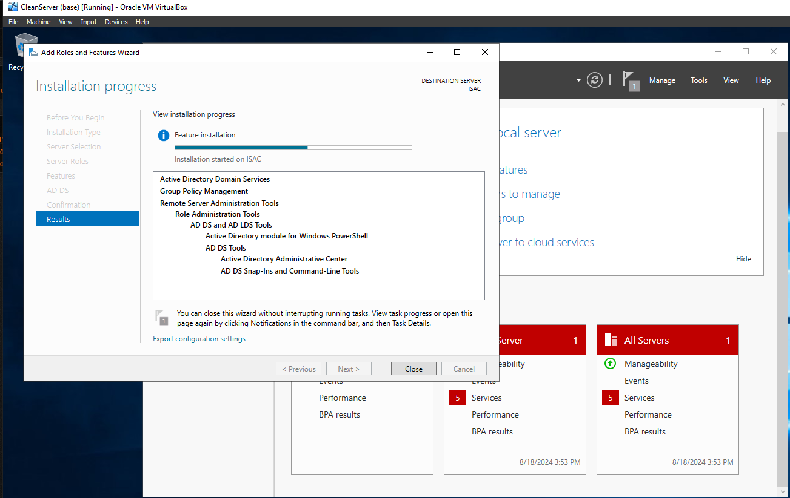
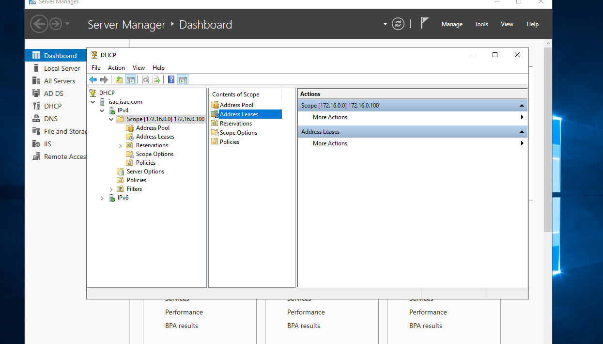
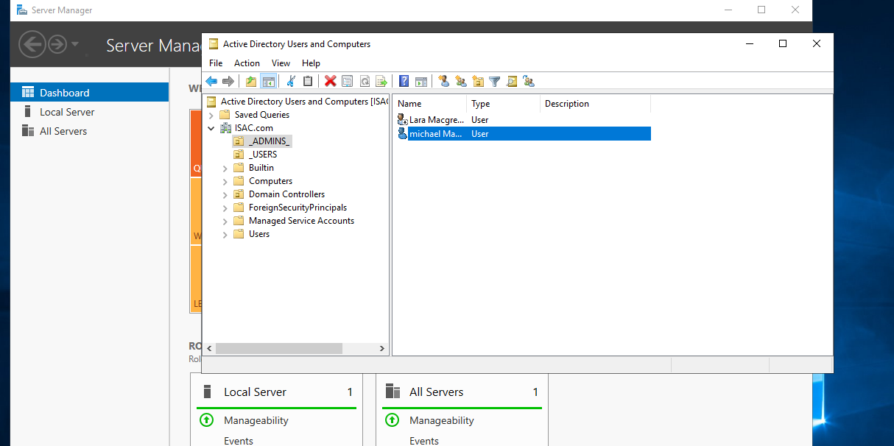

##VM-Active-directory##
<h2>Objectives:</h2>

Set up two VM machines. The first one would be the Server/Server2019, the second Windows 10 Pro.

* VitrualBox
*	Server 2019 ISO Active direcetory - use of a 1000 users powershell Script to added users   
*	Windows 10 Pro ISO system to access server system

<h3>Experience:</h3>
As an aspiring SOC analyst, I was eager to expand my skills through a Active Directory lab, which provided an excellent opportunity to showcase my capabilities. The lab offered a comprehensive overview of industry tools and frameworks, allowing me to gain hands-on experience. Working with Active Direcetory, and incredibly informative.

<h3>Project:</h3>

This lab simulates settting up a work Active directory enviroment, setting up a oganazational unit with one Admin with will be me and 1000 users that will be added via as powerShell script the was provided by Josh Madakor from his github respostory. 

<h2>SET-UP</h2>
Server 2019 (RAS/NAT outside = Internet inside = Intranet) once the VM was set up I started with setting up the InterNet and the IntraNet NIC's one would allow outside connections to the server (this is needed to download scripts and update software) latter in the lab the outside connection will be of use, was inspired to build my own POWERSHELL script to install names to  including a Python name ganerator script 
Github.com - project link

* Domain /AD DS = FQDN ISAC.COM
* RAS/NAT outside = Internet inside = Intranet
* DHCP (1 scope)
  * Range 172.16.0.100-200
  * Mask 255.255.255.0
  * Gateway 172.168.0.1
  * DNS 172.016.0.1

* IntraNet IP used 172.16.0.1 DNS 255.255.255.0  gateway used is a loopback 127.0.0.1 this NIC was set-up in the VM as the secound Adaptor.
* Change the compter name by right click on the start menu - ISAC - just to make things easier when dealing with diffrent comuters on a server map.
* During the process an update was installed Microsoft security patch - then it was onto active directory domain services to begin the build numerous restars as we added add-ons and features.
* Active directory domain services/added root forest

* Start menu administrative tools (This is where I missed a step added users and groups I kept adding my name for the admin forgeting to add the group _ADMINS_ first once I remembered that it was smooth sailing.
 

